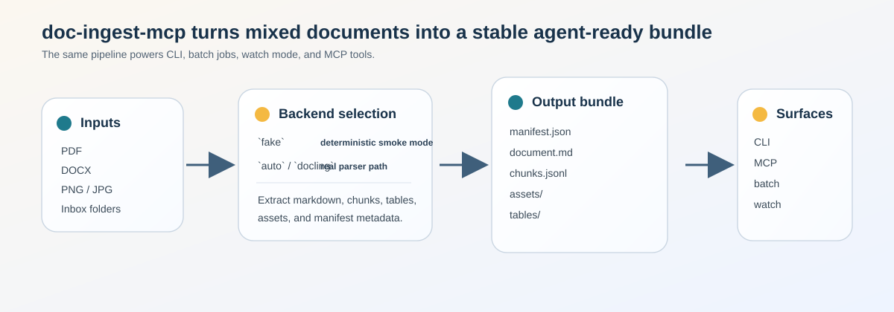
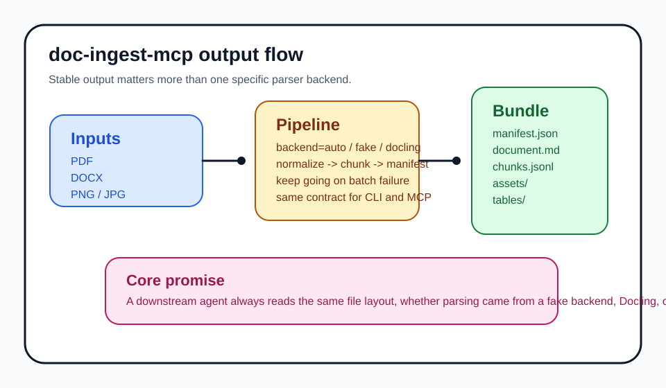

# doc-ingest-mcp

`doc-ingest-mcp` turns messy local documents into a stable bundle that agents can trust. The idea is simple: feed it a PDF, DOCX, or image, and get the same five artifacts every time, whether you call it from the CLI, batch mode, watch mode, or MCP.

## Why this exists

- Agents need predictable document inputs, not a different parser shape for every file type.
- Teams need a clear split between a deterministic smoke path and a real parser path.
- Batch workflows fail more gracefully when each file lands in its own output bundle.

## Backend Modes

| Mode | What it does | Best for |
| --- | --- | --- |
| `fake` | Uses lightweight local extraction for PDF/DOCX and deterministic fallback text for everything else. | Tests, demos, offline dev |
| `auto` | Tries the real Docling pipeline. | Normal runs when `docling` is installed |
| `docling` | Explicit real-parser mode. | Same as `auto`, but spelled out in automation |

The `fake` backend is not a toy. It is the repo's stable smoke path, and it now extracts meaningful text from the bundled PDF and DOCX fixtures so the examples below stay readable.

## Pipeline




The same pipeline powers everything:

- `ingest` for one file
- `batch` for directories
- `watch` for inboxes
- `export` for downstream handoff
- `serve-mcp` for agent access over stdio

## Output Contract

Every ingest writes the same bundle:

- `manifest.json`
- `document.md`
- `chunks.jsonl`
- `assets/`
- `tables/`

`manifest.json` always carries:

- `source`
- `mime_type`
- `page_count`
- `ocr_used`
- `chunk_count`
- `table_count`
- `duration_ms`
- `status`
- `error`

## Real Examples

The repository includes generated examples under [`docs/examples`](docs/examples/README.md).

PDF example:

```json
{
  "source": "C:\\Users\\40436\\Desktop\\doc-ingest-mcp\\tests\\fixtures\\sample.pdf",
  "mime_type": "application/pdf",
  "page_count": 1,
  "ocr_used": false,
  "chunk_count": 3,
  "table_count": 1,
  "duration_ms": 184,
  "status": "ok",
  "error": null
}
```

```md
Document title

Alpha paragraph.

Beta paragraph.
```

DOCX example:

```md
Contract header

Clause one.

Clause two.
```

The matching bundle files are checked in, so the examples are not just README prose:

- [sample.pdf manifest](docs/examples/sample-pdf/manifest.json)
- [sample.pdf markdown](docs/examples/sample-pdf/document.md)
- [contract.docx manifest](docs/examples/contract-docx/manifest.json)
- [contract.docx markdown](docs/examples/contract-docx/document.md)

## CLI

```bash
doc-ingest ingest ./sample.pdf --out ./out/sample --backend fake
doc-ingest batch ./incoming --out ./out --backend fake
doc-ingest watch ./incoming --out ./out --backend fake --once
doc-ingest export ./out/sample --format markdown
doc-ingest serve-mcp
```

The important flags are:

- `--out`: where the output bundle is written
- `--backend`: `fake`, `auto`, or `docling`
- `--format`: `markdown`, `chunks`, or `json`
- `--once`: process the current inbox and exit

## MCP Surface

The MCP server exposes the same behavior over stdio:

- `ingest_document`
- `batch_ingest`
- `get_manifest`
- `read_chunks`
- `export_markdown`

Run it with:

```bash
doc-ingest serve-mcp
```

This command requires the `mcp` extra:

```bash
pip install -e ".[mcp]"
```

## Install

```bash
python -m venv .venv
.venv\\Scripts\\activate
pip install -e ".[dev]"
```

To enable the real parser path:

```bash
pip install -e ".[docling]"
```

## Tests

```bash
pytest
```

The fixture notes live in [`tests/fixtures/README.md`](tests/fixtures/README.md). The smoke corpus stays intentionally small so the repo is quick to clone, easy to read, and stable enough for regression tests.
